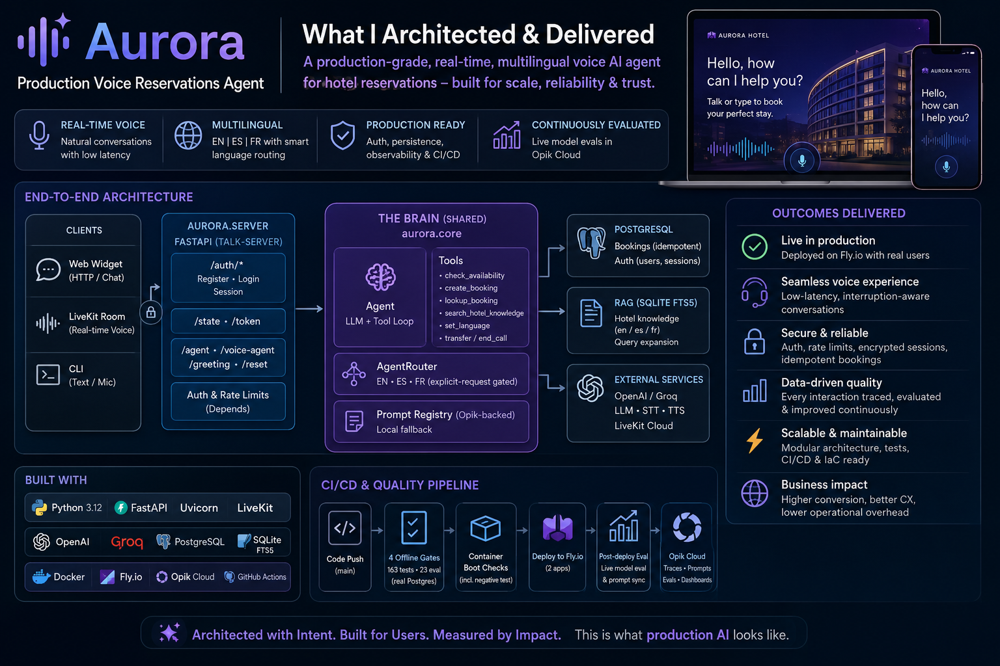
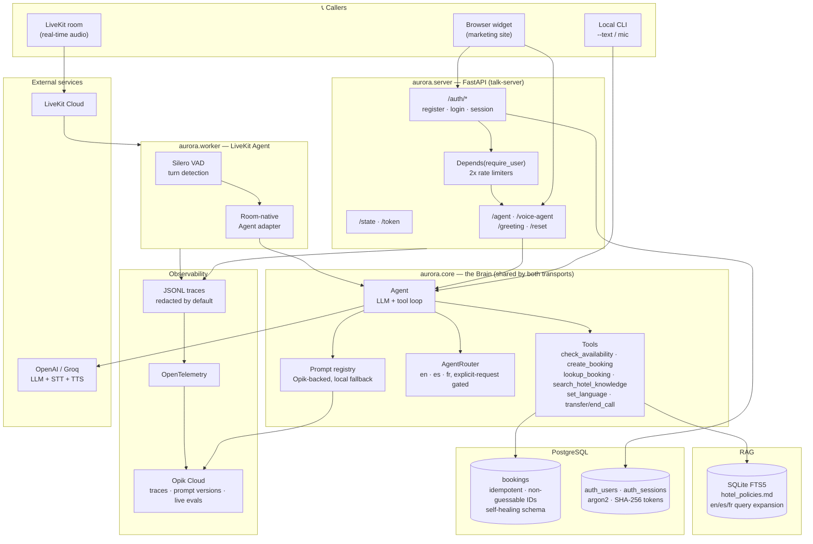
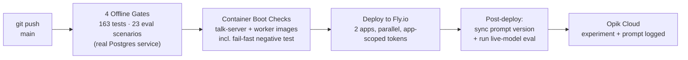

<div align="center">

# 🏨 Aurora — Production Voice Reservations Agent

**A real-time, multilingual voice AI agent for hotel reservations** — cascade voice architecture
(STT → LLM → RAG/Tools → TTS), hardened with real auth, real persistence, real observability, and
continuously evaluated against the live model in production.

[](https://github.com/Bhardwaj-Saurabh/aurora_hotel_concierge_voice_based_agent/actions/workflows/ci.yml)
[](https://aurora-hotel-talk-server.fly.dev)
[](https://fly.io)


[**🎙️ Try the live demo**](https://aurora-hotel-talk-server.fly.dev) · [Runbook](RUNBOOK.md) · [Architecture](#-architecture)

</div>

---

## 🚀 Live Deployment

Aurora is deployed and running right now on a live production environment.



| App | Role | Scaling | Status |
|---|---|---|---|
| [`aurora-hotel-talk-server`](https://aurora-hotel-talk-server.fly.dev) | Public site + FastAPI voice/chat bridge | Scale-to-zero (HTTP traffic) |  |
| `aurora-hotel-agent-worker` | Room-native LiveKit voice agent | Always-on (call traffic) | Internal — joins rooms on dispatch |

Every push to `main` runs the full pipeline below and deploys both apps automatically — see
[**CI/CD status**](https://github.com/Bhardwaj-Saurabh/aurora_hotel_concierge_voice_based_agent/actions/workflows/ci.yml).

Open the [live site](https://aurora-hotel-talk-server.fly.dev), click the chat bubble bottom-right,
and talk or type — it's the real agent, real Postgres persistence, real LLM.

---

## 🧭 Architecture

Two transports (browser HTTP bridge, LiveKit room worker) share one provider-agnostic **brain** —
the same `Agent` code drives text mode, mic mode, and real-time voice with no changes.



### CI/CD pipeline



---

## 💡 Engineering Highlights

Built to survive contact with a real deployment, not just a demo script:

- **Real auth, not a stub** — argon2 password hashing with timing-safe unknown-email verification,
  opaque SHA-256-hashed session tokens, `HttpOnly`/`SameSite=Strict` cookies, and **two independent
  rate limiters** (20 req/hour per authenticated user; 5 attempts/15 min per IP+email pre-auth).
- **Real persistence, not an in-memory toy** — Postgres-backed bookings with idempotent retries
  (the same request can never double-book), random non-guessable confirmation codes (never a
  sequential counter), and a **self-healing schema migration** that detects and repairs column
  drift on an already-deployed table instead of crashing.
- **Grounded, multilingual, and guarded** — RAG answers cite their source section; a hybrid
  deterministic + LLM tool router keeps grounding and language-switching reliable even on noisy
  real speech; red-teamed against prompt injection, policy fabrication, and cross-guest data
  leakage.
- **Full observability** — structured JSONL traces (PII-redacted by default) plus OpenTelemetry,
  exported to **Opik Cloud** for trace search, prompt version history, and evaluation dashboards.
- **Eval-driven development** — 163 unit/integration tests + 23 red-team/core scenarios gate every
  merge; a second harness re-runs the same scenarios against the **real deployed model** on every
  release and logs the results (and any prompt change) to Opik automatically — no manual step.
- **CI/CD that actually ships** — GitHub Actions runs 4 gates against a real Postgres service, boots
  both Docker images with a fail-fast negative test, then deploys two independent Fly.io apps in
  parallel with least-privilege, app-scoped deploy tokens.
- **Debugged like production, because it is** — real incidents found and fixed with live evidence,
  not guesses: a live-model off-topic misclassification traced to a specific temperature setting
  (measured 3/8 → 0/8 failure rate before/after), a speech-recognition bug traced to VAD timing
  clipping the first phoneme of an utterance, and a silent booking-persistence gap in the
  room-native voice worker caught by a startup health check that was missing entirely before.

---

## 🛠️ Tech Stack

| Layer | Technology |
|---|---|
| Language / runtime | Python 3.12, `uv` |
| Voice cascade | WebRTC VAD, OpenAI Whisper (STT), GPT-4o-mini / Llama 3.3 (LLM), OpenAI/Groq TTS |
| Real-time transport | LiveKit Cloud, `livekit-agents`, Silero VAD |
| Web API | FastAPI, Uvicorn, Pydantic-free hand-parsed bodies (deliberate — see Runbook) |
| Retrieval | SQLite FTS5, Markdown knowledge snapshots |
| Persistence | PostgreSQL (`psycopg`), argon2-cffi |
| Observability | Structured JSONL, OpenTelemetry, **Opik Cloud** |
| Deployment | Docker, Fly.io (2 independently-scaled apps) |
| CI/CD | GitHub Actions (gates → container boot checks → deploy → post-deploy eval) |

---

## ✅ Capabilities

- Real hotel availability, booking, and reservation-lookup tools (Postgres-backed, idempotent)
- Hotel-only conversational guardrails, red-team tested
- Local policy RAG using SQLite FTS5 with English/Spanish/French query expansion
- English, Spanish, and French session routing with an explicit-request gate
- Mock, OpenAI, and Groq provider modes — the entire agent/tool/RAG/eval path runs offline for free
- Local microphone capture with WebRTC VAD; browser VAD with adaptive noise calibration and
  playback barge-in
- Per-turn structured telemetry, a browser trace timeline, and Opik Cloud trace/eval dashboards
- LiveKit room-native voice agent, plus a browser HTTP turn-bridge fallback
- Deterministic task evaluation and red-team suites, plus automated live-model evaluation
- Zero-cost capacity calculator for DAU and concurrency planning
- SIP and IVR simulations for telephony mapping

## Project Structure

```text
Assignment_2_voice_agent/
|-- README.md
|-- RUNBOOK.md
|-- knowledge/
|   `-- 2026-07-19/            # date-stamped snapshot; newest loads by default
|       |-- manifest.json      # authoritative file list for the snapshot
|       `-- hotel_policies.md
|-- evals/
|   |-- core.json
|   |-- red_team.json
|   |-- run_evals.py           # offline gate (mock provider)
|   `-- run_live_evals.py      # live-model eval, logs to Opik
|-- pyproject.toml             # one installable package: pip install -e .
|-- src/aurora/
|   |-- core/                  # brain: agent, tools, prompts, providers, router, RAG
|   |-- server/                # FastAPI talk server + packaged browser client (web/)
|   |-- worker/                # room-native LiveKit agent worker
|   |-- voice/                 # local mic/text turn loop
|   |-- storage/                # bookings + user auth (PostgreSQL)
|   |-- telemetry/             # JSONL traces + optional OTel export
|   |-- config/                # .env loader + fail-fast config check
|   `-- ops/                   # smoke, load_test, slo_report, scale_check, sync_prompt, ...
|-- tests/                     # all unit/integration tests (run from the root)
|-- scripts/
|   `-- start_local_livekit.sh
`-- mocks/
    |-- demo_call.py
    |-- ivr_menu_mock.py
    `-- sip-ivr-call-flow.md
```

## Quick Start Without An API Key

The complete agent, tool, RAG, routing, evaluation, and scale paths run without network access or paid requests (bookings/auth do need a Postgres connection — see Runbook §2).

```bash
cd FDE/Assignment_2_voice_agent
uv venv --python 3.12 && source .venv/bin/activate
uv pip install -e ".[server,worker,dev]"
python -m aurora.ops.smoke
python -m unittest -v tests.test_features
PROVIDER=mock python -m aurora.voice.loop --text
```

Try these turns:

```text
What is the weather?
What is the cancellation policy?
I need a room from August 12 to August 14 for two guests.
Please speak Spanish.
¿Cuál es la política de mascotas?
Do I have a booking already?
Connect me to the front desk.
```

## OpenAI Setup

```bash
cd FDE/Assignment_2_voice_agent
uv venv --python 3.12
source .venv/bin/activate
uv pip install -e ".[server,worker,audio,dev]"
cp config.example.env .env && chmod 600 .env
```

Set the following values in `.env`:

```env
PROVIDER=openai
OPENAI_API_KEY=your_key_here
TTS_BACKEND=system
TELEMETRY_JSONL=logs/voice-events.jsonl
POSTGRES_HOST=your_postgres_host   # required — bookings and auth have no local fallback
```

Verify the live model before adding audio:

```bash
python -m aurora.voice.loop --text
```

Run the local microphone cascade:

```bash
python -m aurora.voice.loop
```

The terminal reports capture, STT, routing, retrieval, LLM, tool, TTS, and total turn timing. `TTS_BACKEND=system` uses the macOS voice and avoids cloud TTS cost during rehearsal.

Set `TTS_BACKEND=provider` to use the selected provider's configured TTS model and voice. Provider TTS incurs audio-generation cost.

## Groq Setup

The provider adapter uses the same tool-calling interface for OpenAI and Groq.

```env
PROVIDER=groq
GROQ_API_KEY=your_key_here
TTS_BACKEND=system
```

The commands remain the same.

## Local LiveKit Demo

The room demo uses the same root install (the browser's LiveKit client library is vendored
inside the package — no npm step). Use three terminals from the assignment root.

Terminal 1 starts the self-contained LiveKit development server:

```bash
./scripts/start_local_livekit.sh
```

Terminal 2 creates the room and starts the browser application:

```bash
source .venv/bin/activate
python -m aurora.ops.create_room
python -m aurora.server
```

Open `http://localhost:5173`, click **Start call**, allow microphone access, and speak naturally. The browser automatically joins the caller and Aurora participants, detects caller turns, displays grounding sources, and shows stage telemetry.

The LiveKit bridge honors `TTS_BACKEND` from `.env`. With `provider`, the server synthesizes WAV audio using `TTS_MODEL` and `TTS_VOICE`, and the UI labels the response with the selected voice. With `system` or `mock`, the browser uses its installed speech voice.

The browser exposes two workshop controls:

- **Endpoint silence** changes how long a pause must be before a turn is committed.
- **Speech sensitivity** changes the adaptive speech threshold relative to the measured noise floor.

Speak while Aurora is playing a response to demonstrate playback barge-in. The browser cancels speech output, records the interruption, and opens the next caller turn.

### LiveKit Boundary

Two agent transports exist:

- **HTTP turn bridge** (`aurora.server`, the FastAPI talk server, default demo path): the browser records a completed
  turn and POSTs audio to `/voice-agent`; browser or provider TTS speaks the reply.
- **Room-native agent worker** (`aurora.worker`): the agent joins the room as a participant,
  subscribes to the caller's audio track, runs Silero VAD/turn detection server-side, and
  publishes Aurora's replies as a TTS audio track. The same `Agent` powers both — the
  worker only replaces the transport.

Run the worker against the local server (requires a live provider; the mock cannot hear or speak):

```bash
source .venv/bin/activate
LIVEKIT_URL=ws://localhost:7880 LIVEKIT_API_KEY=devkey LIVEKIT_API_SECRET=secret \
python -m aurora.worker dev
```

Then join the room from the browser app; the worker is dispatched automatically.

Remaining production extensions: streaming STT/LLM/TTS, distributed barge-in cancellation, and SIP dispatch.

## Grounding And Tools

Aurora uses different boundaries for different kinds of truth:

| Information | Mechanism | Reason |
|-------------|-----------|--------|
| Policies, parking, pets, breakfast, accessibility | Local RAG | Read-oriented knowledge with source evidence |
| Availability and room rates | Tool call | Dynamic operational truth |
| Booking creation | Tool call | Auditable state mutation |
| Existing reservation lookup | Tool call | Confirmation code, or name + contact together — never a bare name |
| Language switching | `set_language` control tool | Validated session state and matching TTS locale |
| Transfer and hangup | Control action | Runtime and telephony behavior |

The local retriever indexes Markdown sections with SQLite FTS5. It includes English, Spanish, and French query expansion while keeping the source document unchanged.

Aurora uses hybrid tool routing. High-confidence policy/amenity phrases and explicit language names select their tool in application code before the first model call — this keeps retrieval and language switching reliable after interruptions, off-topic turns, or noisy real speech, without routing a request such as `cancel my reservation` into policy search.

## Telemetry

Each turn carries a session ID, turn ID, trace ID, provider, model, prompt version, language, stage timings, tool arguments, tool results, sources, action, and ordered runtime events.

Raw transcript and response content are omitted by default, and sensitive tool fields such as guest name and contact details are redacted. Set `TELEMETRY_INCLUDE_CONTENT=true` only for controlled local debugging with non-sensitive data.

Traces write to a local JSONL file (git-ignored) and, when configured, to an OpenTelemetry collector — including **Opik Cloud**, which also hosts the versioned prompt library and evaluation experiments.

```text
logs/voice-events.jsonl
```

Important production measures include endpoint delay, STT latency, LLM time to first token, tool latency, TTS time to first audio, end-of-turn to first audio, interruption latency, task completion, critical entity accuracy, transfer rate, and cost per successful outcome.

## Evaluation And Red Teaming

Run all deterministic scenarios (offline, mock provider, no cost):

```bash
python evals/run_evals.py --suite all
```

Run one suite with conversation details:

```bash
python evals/run_evals.py --suite core --verbose
python evals/run_evals.py --suite red-team --verbose
```

The suites verify expected tools, actions, languages, sources, allowed text, and forbidden text. The red-team set covers prompt injection, policy fabrication, privacy, structured tool input, and guardrails after a language switch.

**Live-model evaluation** re-runs the same scenarios against the real configured provider, multiple trials each (sampling is non-deterministic), and logs a proper Experiment to Opik:

```bash
python evals/run_live_evals.py --suite all --trials 3
```

This runs automatically after every deploy (see the CI/CD diagram above) — no manual trigger needed.

## Scale Check

The calculator converts product assumptions into peak concurrency and service demand without calling a provider:

```bash
python -m aurora.ops.scale_check --dau 1000000
```

Default assumptions are 0.25 calls per DAU, four minutes per call, three turns per minute, an 8x peak factor, 40 sessions per worker, and 30 percent headroom. Change every assumption before using the result as a capacity plan.

Example with a blended variable cost:

```bash
python -m aurora.ops.scale_check --dau 1000000 --cost-per-minute 0.035
```

## Telephony Mapping

```text
PSTN caller -> carrier -> SIP trunk -> SBC or SIP edge -> LiveKit room -> agent -> tools
```

Run the local signaling demonstrations:

```bash
cd FDE/Assignment_2_voice_agent/mocks
python3 demo_call.py
python3 demo_call.py --transfer
python3 ivr_menu_mock.py
```

The mock maps booking completion to SIP BYE and human escalation to SIP REFER. A real phone deployment also requires a carrier or telephony provider, an internet-reachable SIP edge, codec and media negotiation, security policy, dispatch rules, and a room-native agent worker (already built — see `aurora.worker`).

## Safety And Cost

- Keep `.env`, virtual environments, telemetry logs, and private workshop materials out of Git.
- Do not enable raw telemetry content for real customer conversations without an approved privacy and retention policy.
- Use mock mode for rehearsal, evaluation, and scale exercises.
- Use system TTS while developing to avoid cloud TTS charges.
- Booking and auth tools are real, Postgres-backed, and idempotent — production secrets, rate limiting, and non-guessable confirmation IDs are already in place (see Engineering Highlights above and `RUNBOOK.md` for operational detail).

---

<div align="center">

Built as a Forward-Deployed Engineering exercise — from a scripted demo to a monitored,
continuously-evaluated, auto-deployed production service.

[Runbook](RUNBOOK.md) for operations · [Live demo](https://aurora-hotel-talk-server.fly.dev) to try it

</div>
